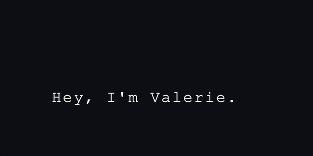

<p align="center">
  
</p>


<p align="center">
  
</p>


<p align="center"><strong>Engineer x Designer x Builder of Beautiful Things</strong></p>


 

<p align="center">
  <em>👩‍💻 Full-stack Dev in the making | Design Driven | C++ enthusiast</em>
</p>

---

<p align="center">
   Currently building <strong><a href="https://github.com/valerie-ekeigwe/The-Bean-Book">The Bean Book</a></strong>: a coworking space booking system.<br/>
   Passionate about UI/UX, creative tools, and all things C++.<br/>
   Open to internships, freelance work, and collaborative builds.
</p>

---

##  My Developer Thread
>  `Software Engineering @ Ontario Tech`  
>  `I build interactive web & mobile apps`  
>  `Design enthusiast | Figma, Framer, Blender`  
>  `Exploring LLMs & creative tech`  
>  `Let’s build something amazing together!`  

---

## Tech Stack (click to expand)

<details>
  <summary><strong> Frontend</strong></summary>
  <p>
    
    
    
    
    
    
    
    
  </p>
</details>

<details>
  <summary><strong> Backend & DB</strong></summary>
  <p>
    
    
    
    
    
  </p>
</details>

<details>
  <summary><strong> Creative Tech</strong></summary>
  <p>
    
    
    
    
  </p>
</details>

<details>
  <summary><strong>📱 Design & Tools</strong></summary>
  <p>
    
    
    
    
    
    
  </p>
</details>

---

##  Pinned Projects

|  Projects | Description | Stack |
|-----------|-------------|-------|
|  [**Auto Read.ME Generator**](https://github.com/valerie-ekeigwe/Auto-Read-Me-Generator) | Instantly generates professional `README.md` files from GitHub repository metadata | `Python`, `GitHub API`, `Markdown` |
|  [**The Bean Book**](https://github.com/valerie-ekeigwe/The-Bean-Book) | Booking system for Ink and Bean | `HTML`, `CSS`, `JavaScript`, `MongoDB`, `EmailJS` |
|  [**Capsrow Landing Page**](https://github.com/valerie-ekeigwe/Capsrow-Landing-Page) | Framer-style product landing | `Next.js`, `Tailwind`, `Framer Motion`, `TypeScript` |

---

## 📬 Let’s Connect

[](https://instagram.com/valerieekeigwe)
[](https://www.linkedin.com/in/valerie-ekeigwe-804ba1320/)
[](mailto:valeriecekeigwe@gmail.com)
[](https://valerieekeigwe.substack.com/)

---

##  GitHub Stats

<p align="center">
  
  
</p>

<p align="center">
  
</p>

---
 
<p align="center">
  <picture>
    <source media="(prefers-color-scheme: dark)" srcset="https://raw.githubusercontent.com/valerie-ekeigwe/github-snake/output/github-contribution-grid-snake-dark.svg">
    
  </picture>
</p>

---

<p align="center">
  
</p>

---

##  Now Learning / Building

```js
const nowLearning = [
  'Kubernetes',
  'Currently honing in on my Front-End Skills',
  'MongoDB & EmailJS Integration 💌',
  'Custom Dashboards & Admin UIs 📊'
];
